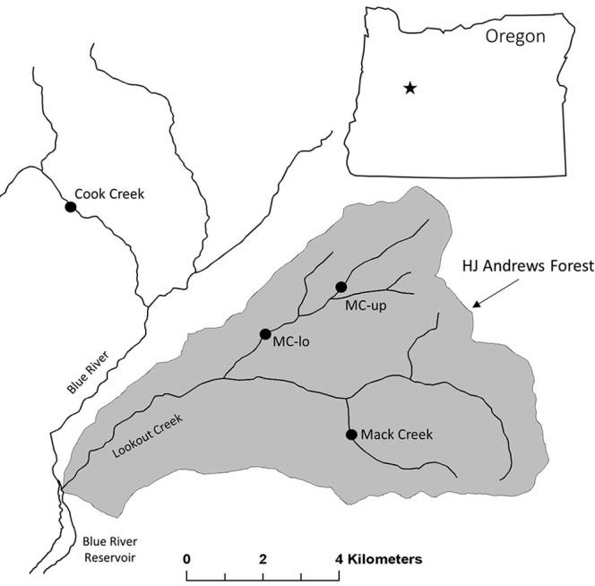

```{r setup, include=FALSE}
knitr::opts_chunk$set(echo = FALSE, message=FALSE, warning=FALSE)
```

## 1. Introduction


**Image 1:** *Pacific Giant Salamander. Credit: Gary Nafis for [California Herps](http://www.californiaherps.com/salamanders/pages/d.tenebrosus.html) *

Pacific Giant Salamanders, Dicamptodon tenebrosus, were surveyed in Oregon at the Andrews Experimental forest. This aquatic vertebrae study was sponsored and funded by the National Science Foundation's [Long-Term Ecological Research Program](https://portal.lternet.edu/nis/mapbrowse?packageid=knb-lter-and.4027.12) (Andrews LTER). Researcher Stanley V. Gregory (2017) began observing populations in 1993, and has continued research into this day that has become one of the longest, uninterrupted studies of salamander populations recorded. In his surveys, Stanley observed Dicamptodon tenebrosus populations in two different settings, from which he gathered extensive data by weighing and measuring the salamanders. 

Evaluating populations from old growth forest and a clear-cut forest reveals a study in contrasts regarding the salamanders’ day to day survival. One would imagine that in a clear-cut forest, the cutting down of trees would lead to soil erosion and excess run off into creeks. The lack of vegetation could have additional detrimental effects for healthy salamander populations, including a dwindling amount of hiding spaces with less vegetation (Sagar et al., 2007). All of this habitat destruction could have profound effects on biodiversity that would likely lead to a decrease in salamander population sizes and weights in clear-cut forest. In old growth forests, one would predict that salamander populations would be in a more stable environment, suggesting the population and weight of those samples would be more consistent and at healthier levels.

## 2. Data and methods



**Image 2:** *Map of H.J. Andrews Experimental forest. Credit:[Dana Warren](https://www.researchgate.net/figure/Map-of-study-sites-and-the-HJ-Andrews-Experimental-forest-HJA-Each-dot-represents-a_fig1_314206020) *

Data for Pacific Giant Salamander (*Dicamptodon tenebrosus*), forest condition and location were collected by Andrews LTER. The Pacific Giant Salamander population was monitored in two standard reaches of Mack Creek: a clear-cut forest (CC), and an upstream 500 year-old coniferous forest (OG).

The Pacific Giant Salamander abundance is sampled by live capture and with 2-pass electrofishing (Gregory, 2017). The salamander samples were observed in the pool (p), cascade (c) and side channel (SC) of the creek. A group of specimens were observed in isolated pools (IP), but they are not included in this analysis.  For more information on collection methods, see [metada](https://portal.lternet.edu/nis/metadataviewer?packageid=knb-lter-and.4027.13).

We employ an exploratory data visualization (historical evolution, distribution and general statistics analysis) of the Pacific Giant Salamander counts, weight and distribution. Through a Chi2 (α = 0.05), we evaluate if there is a significant effect of forest condition (CC or OG) on where the salamanders are located (P, C and SC). Then, with ANOVA tests (α = 0.05), we analyze the following questions:

- Is there a significant difference in mean weights for Pacific giant salamanders observed in the two forest sections (CC vs OG)?
- Is there a significant difference in mean weights for Pacific giant salamanders observed according to where they are found (C vs SC vs P)?

Additionally, for the second question, we evaluate the effect size on weight means among locations.

All the calculations and tests are performed by **R software version 3.6.1.**


## 3. Results

```{r}
# Attach relevant packages
library(tidyverse) 
library(janitor)
library(here)
library(dplyr)
library(effsize) # to make Cohen's size test
library(kableExtra) # to make tables
library(car) # to do Levene test  
library(ggbeeswarm) # to do our beeswarm graph
library(effsize) # to do Cohen's effect size test

#We read the Mack Creek vertebrates dataset, clean names and filter the relevant species
mcreek_vertebrates <- read_csv(here::here("mack_creek_vertebrates.csv")) %>% 
  clean_names() %>% 
  filter(species=="DITE")

# We consider the observations counts in for each year and forest section
salamander_counts <- mcreek_vertebrates %>% 
 count(year, section) #We sum all the observations by year and section

# We save the caption of the figure1
titlefigure1 = expression(paste(bold("Figure 1: Salamander abundance 1989-2017:"), 
                                "By Old growth (OG) and clear cut(CC) forests. Source: Andrews LTER")) 

# We graph the salamander abundance throught time
sala_graph1 <- ggplot(salamander_counts, aes(x= year, 
                                             y= n, 
                                             group= section, 
                                             colour= section)) + # Group and color by section
  geom_line() + #we create our line graph
  labs(x="Years", 
       y="Total salamander counts per year",
       caption= titlefigure1) + # we create title, axis title and caption
  theme_minimal() # We select the theme minimal
 
```

### 3.1. Historical salamander abundance by forest condition

In 1993, both population counts started at almost the same level. However, between 1995 and 1999, the clear-cut forest salamander decline was alarming. In the year 2000, even though both populations experienced a steep rise, the clear-cut group experienced a greater surge; considering their relative decline. Until 2014, both groups experienced similar fluctuations, but the old growth population dominated in total quantity. However, after the population fall of 2013-2014, the clear-cut forest salamanders once again experience a notable increase, surpassing the old growth population.

The higher sample counts for clear-cut forest salamander may indicate its resilience and adaptive capacity to differing habitats.

```{r}

#We add more format details to our figure 1
sala_graph1 + 
  theme(legend.position="top") + # We put the legend above the graphs
  theme(plot.caption = element_text(hjust = 0)) # We center caption to the left
```

### 3.2 Salamander abundance by location in the year 2017

Considering the increasing abundance of both populations during 2017, we extend the analysis by including the locations where they are found (Figure 2). The collected samples of clear-cut salamanders are higher than the old growth forest ones in the case of cascade (247 vs 201) and side channel (90 vs 74) locations. The opposite happens for pool location (30 vs 45) within the creek. 

```{r}
# We create a new table to keep location and forest section
classi_section <- mcreek_vertebrates %>%  
  filter(year==2017) %>% # Only for the year 2017
  filter(unittype %in% c("C", "P", "SC")) %>% # We dont include isolated pools (IP)
  count(section, unittype) # We count by forestion section and location

classi_section_table <- classi_section %>% 
  pivot_wider(names_from = section, values_from = n) # We pivot our table accordint to forest condition

classi_section_props <- classi_section_table %>% # We creater a proportions table
  adorn_percentages(denominator = "row") %>% 
    adorn_pct_formatting(digits = 2) %>% 
  adorn_ns(position="front")
 
colnames(classi_section_props) <- c("Location","Clear cut", "Old growth") # Format column names of proportions table

# We create our final table included caption, column width and bootstrap striped
kable(classi_section_props, 
      caption = "Table 1: Number of salamanders by forest condition and location 2017") %>% 
  kable_styling(bootstrap_options = "striped", full_width = F)
```
Own elaboration, source: Andrews LTER

If we maintain the hypothesis about the species resilience and adaptability, the clear-cut forest salamander is thriving as an opportunist, asserting itself in a new environment that presents less competition. However, this speculation goes against the reproductive lifestyle of this species: the Pacific Giant Salamander’s breeding ground are usually in still waters (Federal Energy Regulatory Comission, 2003). If the resilience hypothesis holds true, it suggests the salamanders have modified their behavior, switching to breeding in running waters. Nevertheless, this conjecture fails to explain how the larvae would manage to survive in a more hostile environment, especially when the absence of vegetation favors stronger currents.

The old growth forest salamander primarily resides in pools, their main reproductive habitat. Moreover, in old growth forests, there is far less soil erosion and more opportunities for pool/pond formation, as well as greater variance terrain and habitat (Sagar et al., 2007) This leads us to believe that the population surge in clear-cut forests salamanders are temporary, as shown in the historical data (Figure 1). Without enough places to reproduce and hide (especially in the case of larvae), it is expected that the clear-cut population will diminish over time.

### 3.3 Effect of forest condition on salamander abundance by location


```{r}

# We test chi 2 for evaluate independence between forest condition and location

# We extract the neccessary information from our table
salamander_chi_counts <- classi_section_table %>% 
  select(-unittype) # We dont keetp the column unittype

# We apply the chi 2 test
salamander_chi <- chisq.test(salamander_chi_counts)

#salamander_chi
```

Considering the discussion of the previous section, it is reasonable to test the effect of forest condition (clear cut and old growth) over the salamander abundance by where they are found. According to the results of the chi squared test, there is no significant association where the salamanders are found (cascade, pool and side channel) with the forest condition ($\chi^2$ (`r salamander_chi$parameter`) = `r round(salamander_chi$statistic,2)`, *p* = `r round(salamander_chi$p.value,2)`). 

It would be premature to draw broad inferences from this test, considering we are only evaluating the year 2017 and not the whole period of available data. With all things considered, this might not be the most meaningful interpretation of the data, given it is the longest continuous record of salamander populations. 

### 3.4 Mean weights of salamanders by forest condition 2017


```{r}
# We construct our salamander weight database
sala_section_weight_2017 <- mcreek_vertebrates %>% 
  filter(year==2017) %>% 
  group_by(section) %>% 
  select(weight)

# We create a dataset with the summary stats
sala_s_summary <- sala_section_weight_2017 %>% 
  group_by(section) %>% 
  summarize(
    mean_weight=round(mean(weight, na.rm=TRUE),2), # mean
    sd_weight=round(sd(weight, na.rm=TRUE), 2), # sd
    sample_size=n() # n
  )

sala_s_summary_1 <- sala_s_summary # We keep our summary in other table to do some format edition

colnames(sala_s_summary_1) <- c("Forest condition","Mean", "SD", "Sample size") #  Format column names 

# Means

OG_2017_mean <- round(mean(sala_section_weight_2017[which(sala_section_weight_2017$section=="OG"),]$weight, na.rm = TRUE), digits = 1) # Mean OG 2017
CC_2017_mean <- round(mean(sala_section_weight_2017[which(sala_section_weight_2017$section=="CC"),]$weight, na.rm = TRUE), digits = 1) # Mean CC 2017
DIF_2017_mean <- abs(CC_2017_mean - OG_2017_mean) # Mean difference

```

The mean weights of the salamanders are strikingly similar, despite populations coming from such different habitats. Taking into account that the sample sizes are relatively close, the standard deviation and mean weight of each samples correspond closely to one another. The mean weight of clear-cut salamanders is just `r DIF_2017_mean` grams above that of the old growth forest salamanders. At first glance, these statistics potentially weaken the preliminary claim that salamanders in clear-cut forests struggle and decrease in weight and count, when compared to salamanders from the old growth forest. Nonetheless, these samples consider only one year (2017), which restricts the data’s utility in deciphering more long-term patterns. 


```{r}

# We create our final table included caption, column width and bootstrap striped
kable(sala_s_summary_1, 
      caption = "Table 2: General statistics of salamander weight by forest condition 2017") %>% 
  kable_styling(bootstrap_options = "striped", full_width = F)
```
Own elaboration, source: Andrews LTER

Both forest sections have numerous outliers that are considerably outside the standard deviation range: 14 of the 328 salamanders for the old growth forest and and 8 salamanders from the clear-cut sample. Anchoring the data by the mean, inaccurately skews the sample distribution. On the other hand, comparing both samples by the median enables more meaningful insights that more accurately reflect the reality of the sample population. In this context, the mean weight comparison might not be the most effective method because both samples have distributions clustered towards the lower weight values. 

```{r}
# Leneve test
sala_weight_s_leneve <- leveneTest(weight~section, data=sala_section_weight_2017)

# We extract the p value of our Leneve test
sala_weight_s_leneve_p <-  na.omit(sala_weight_s_leneve) %>% 
 clean_names() %>% 
  select(pr_f) # We call the p value
```

```{r}

# We create the caption title for our figure 2
titlefigure2 = expression(paste(bold("Figure 2: Salamander weight distribution 2017."), 
                                "By Old growth (OG) and clear cut(CC) forests. Source: Andrews LTER"))

# We create our figure 2: beeswarm graph of salamander weight by section
sala_graph2 <- ggplot()+
  geom_beeswarm(data=sala_section_weight_2017, aes(x=section, y=weight),
                size=1,
                alpha=0.6,
                color="gray60"
                ) +
  scale_x_discrete(labels = c("Old growth", "Clear cut"))+
  geom_point(data=sala_s_summary, aes(x=section, y=mean_weight),
       color="red",
       size=2) + # within each data bend, vertical arrange histograms.
  geom_errorbar(data=sala_s_summary,
                aes(x=section, ymin= mean_weight - sd_weight
                    ,ymax= mean_weight + sd_weight
                    )) 
 
# Additional format edition for figure 2
 sala_graph2 + 
   labs(x="Forest section", 
       y="Salamander weight (gram)",
       caption= titlefigure2) + # we create title, axis title and caption
  theme(legend.position="top") + # We put the legend above the graphs
  theme(plot.caption = element_text(hjust = 0)) # We center caption to the left
```

The salamander's weight doesnt present a normal distribution for any of the forest conditions (Appendix 1). However, the Leneve Test suggest we should retain the null hypothesis that weight  variances between forest sections are equal (p-value=`r round(sala_weight_s_leneve_p$pr_f,3)`, *p*<0.05). Considering its relative robustness even when the normality assupmtion does not apply, we will use the ANOVA test.

```{r}

# Anova test of salamander weight by forest condition
sala_weight_s_aov <- aov(weight~section, data=sala_section_weight_2017)

# summary(sala_weight_s_aov)

# We save our anova outputs
aov_outputs_s_c <- unlist(summary(sala_weight_s_aov))

```

According to the ANOVA test, the salamander's weight means across the forest sections (old growth and clear cut) differ significantly (one-way ANOVA, F(`r aov_outputs_s_c[1]`, `r aov_outputs_s_c[2]`) = `r round(aov_outputs_s_c[7],2)`, *p* = `r round(aov_outputs_s_c[9],10)`). This result reveals that the mean difference of `r DIF_2017_mean` grams is significant. More research is needed because the reproductive behaviour of the salamander responds to many factors including weight loss during mating. In addition, the number tadpoles is a vital indicator of a healthy and stable population, which might complement the current data.

### 3.5 Mean weights of salamander by location 2017

```{r}

# We construct our salamander weight database by location (where they are found)
sala_class_weight_2017 <- mcreek_vertebrates %>% 
  filter(year==2017) %>% # Just for the year 2017
  filter(unittype %in% c("C", "P", "SC")) %>% # We dont include isolated pools (IP)
  group_by(unittype) %>% #Group by location
  select(weight) # We keep weight


# We create a dataset with the summary stats
sala_c_summary <- sala_class_weight_2017 %>% 
  group_by(unittype) %>% 
  summarize(
    mean_weight=round(mean(weight, na.rm=TRUE),2), # mean
    sd_weight=round(sd(weight, na.rm=TRUE), 2), # SD
    sample_size=n() # n
  )

sala_c_summary_1 <- sala_c_summary # We keep our summary in other table to do some format edition

colnames(sala_c_summary_1) <- c("Location","Mean", "SD", "Sample size") # Format column names

# Means, SD, samples

P_2017_mean <- round(mean(sala_class_weight_2017[which(sala_class_weight_2017$unittype=="P"),]$weight, na.rm = TRUE), digits = 1) # Mean P 2017

P_2017_sd <- round(sd(sala_class_weight_2017[which(sala_class_weight_2017$unittype=="P"),]$weight, na.rm = TRUE), digits = 1) # SD P 2017
SC_2017_sd <- round(sd(sala_class_weight_2017[which(sala_class_weight_2017$unittype=="SC"),]$weight, na.rm = TRUE), digits = 1) # SD SC 2017


```

The mean weights of the salamanders are different across locations. The salamanders found in pools weigh the most (`r P_2017_mean` grams) as expected to theory (Leigthon, 2011). In addition, the standard deviation differ in each case: there is greater spread in the pool salamander (`r P_2017_sd` grams) and less in the case of side channels (`r SC_2017_sd` grams). However, it is neccessary to gather more information about pool salamanders because its sample's size is relatively low when compared to the other locations. 

```{r}

# We create our final table included caption, column width and bootstrap striped
kable(sala_c_summary_1, 
      caption = "Table 3: General statistics of salamander weight by location 2017") %>% 
  kable_styling(bootstrap_options = "striped", full_width = F) 

```
Own elaboration, source: Andrews LTER

```{r}
# Leneve test
sala_weight_c_leneve <- leveneTest(weight~unittype, data= sala_class_weight_2017)

# We extract the p value of our Leneve test
sala_weight_c_leneve_p <-  na.omit(sala_weight_c_leneve) %>% 
 clean_names() %>% 
  select(pr_f) # We call the p value
```

All locations have numerous outliers that are considerably outside the standard their deviation range. In the case of cascade and side channel the major part of observations are clustered around the lower weight values. For pool salamanders, it seems the same pattern repeats but the relatively reduced number of observations can't draw a definitive conclusion. In this context, the mean weight comparison might not be the most effective method because the samples present skewness and outliers.

```{r}

# We create the caption title for our figure 3
titlefigure3 = expression(paste(bold("Figure 3: Salamander weight distribution 2017."), 
                                "By cascades (C), pools(P) and side channels (SC). Source: Andrews LTER"))

# We create our figure 3: beeswarm graph of salamander weight by classification
sala_graph3 <- ggplot()+
  geom_beeswarm(data=sala_class_weight_2017, aes(x=unittype, y=weight),
                size=1,
                alpha=0.6,
                color="gray60"
                ) +
   scale_x_discrete(labels = c("Cascade", "Pool", "Side channel"))+
  geom_point(data=sala_c_summary, aes(x=unittype, y=mean_weight),
       color="red",
       size=2) + # within each data bend, vertical arrange histograms.
  geom_errorbar(data=sala_c_summary,
                aes(x=unittype, ymin= mean_weight - sd_weight
                    ,ymax= mean_weight + sd_weight
                    )) 
 
 # Additional format edition for figure 3
 sala_graph3 + 
   labs(x="Location", 
       y="Salamander weight (gram)",
       caption= titlefigure3) + # we create title, axis title and caption
  theme(legend.position="top") + # We put the legend above the graphs
  theme(plot.caption = element_text(hjust = 0))  # We center caption to the left

```

The salamander's weight doesn’t present a normal distribution for any location (Appendix 2). However, the Leneve Test suggest we should retain the null hypothesis that weight variances between forest sections are equal (p-value=`r round(sala_weight_c_leneve_p$pr_f,2)`, *p*<0.05). Considering its relative robustness even when the normality assumption does not apply, we will use the ANOVA test.

```{r}

# Anova test of salamander weight by location (cascade, pool and side channel)
sala_weight_c_aov <- aov(weight~unittype, data=sala_class_weight_2017)

#summary(sala_weight_c_aov)

# We save our anova outputs
aov_outputs_w_c <- unlist(summary(sala_weight_c_aov))

```


```{r}
# We apply the Tuskey HSD test
sala_post_hoc_w_c <- TukeyHSD(sala_weight_c_aov)
#sala_post_hoc_w_c

```

According to the ANOVA test, the salamander's weight means across the places where they are found (cascades, pools and side channels) differ significantly (one-way ANOVA with post-hoc Tukey's HSD, F(`r aov_outputs_w_c[1]`, `r aov_outputs_w_c[2]`) = `r round(aov_outputs_w_c[7],2)`, *p* = `r round(aov_outputs_w_c[9],2)`). According to Tukey test, the only pair where the weight means dont differ significantly is between side channels and cascades (p-value = 0.16, *p*<0.05). 

```{r}
# Dataset year 2017 and POOL location

cohen_pool_w <- na.omit(sala_class_weight_2017) %>% 
  filter(unittype=="P") 

# Dataset year 2017 and CASCADE location
cohen_cascade_w <- na.omit(sala_class_weight_2017) %>% 
 filter(unittype=="C")
  
# Dataset year 2017 and SIDE CHANNEL location
cohen_side_channel_w <- na.omit(sala_class_weight_2017) %>% 
filter(unittype=="SC") 

# Cohen size effect test

sala_pool_side = effsize::cohen.d(cohen_pool_w$weight, cohen_side_channel_w$weight, paired=FALSE) # cohen for P and SC

sala_pool_cascade = effsize::cohen.d(cohen_pool_w$weight, cohen_cascade_w$weight, paired=FALSE) # cohen for P and C

sala_side_cascade = effsize::cohen.d(cohen_side_channel_w$weight, cohen_cascade_w$weight, paired=FALSE) # cohen for SC and C

# sala_pool_side 
# sala_pool_cascade 
# sala_side_cascade 

```

In addition, we employ a Cohen's effect size test to quantify the difference of salamander weights by each pair of locations:

- Pool vs. side channel: the effect size is **moderate** (Cohen’s d= `r abs(round(sala_pool_side$estimate, 2))`)
- Pool vs. cascade: the effect size is **low** (Cohen’s d= `r abs(round(sala_pool_cascade$estimate, 2))`)
- Side channel vs. cascade: the effect size is **barely moderate** (Cohen’s d= `r abs(round(sala_side_cascade$estimate, 2))`)

In general, the difference in weight means are moderate across location groups (P vs SC and SC vs C), but the effect size for SD and C is nearer to a low value (`r abs(round(sala_side_cascade$estimate, 2))`). In addition, as we mentioned, the Tukey test did not find a significant difference between SD and C. If we consider the Tukey test and apply a **conservative approach**, we determine there is no significant difference in mean weights for P vs. C and SC vs C. On the other hand, there is a moderate size effect for salamander found in pools versus side channels. This results seems reasonable if we consider that adult (and bigger) salamander prefer slow waters to mate and reproduce. 

Finally, it is important to highlight that using mean tests aren't the best approach for the current analysis. In **Figure 3**, we appreciate the presence of outliers observations and distribution concentration on the low weigth values. This skewness is also seen in Appendix 2. In this context, future research should use median based tests because they are less influenced by outlier values and distribution assymmetry. It is likely that under this context, some contradictions will be resolved. Moreover, we recommend to conduct this assessment through all the period of study to take advantage of the data series lengthy recorded history.

## 4. Summary

- According to the P value, there is no significant association between forest condition (OG and CC) and the location where the salamanders reside (cascades, pool and side channel). However, research shows that salamanders reproduce in slow moving waters, which is supported by the old growth numbers (Table 1). In addition, the pool formation is more prominent in habitats with abundant vegetation.
- The mean weight between salamanders by forest condition (OG and CC) differ significantly, according to a one-way anova test from a 2017 survey.
- The mean weight between salamanders in all three locations (C, SC and P) differ significantly, according to a one-way anova test from a 2017 survey. The only exception is comparing pools to cascades or side channels under the Tukey Test. 
- Future research should use median based tests because they are less influenced by outlier values and distribution assymmetry. 
- We recommend to conduct this assessment through all the period of study to take advantage of the data series lengthy recorded history. In addition, more samples for pool salamanders and tadpole observations are needed to strenghen the analysis of the reproductive behavior of the species according to forest condition and location. 
 

## References

Bull Run Hydroelectric Project, Federal Energy Regulatory Commission (2003). [Environmental Impact Statement](https://books.google.com/books?id=JOk0AQAAMAAJ&pg=PA155&lpg=PA155&dq=pacific+giant+salamander+breeding+in+pools+cascades+side+channels&source=bl&ots=X340rnMH-w&sig=ACfU3U3XAEhpbYIgRSLBSxvQ9Rn1T62fAw&hl=en&sa=X&ved=2ahUKEwiB3KbOw5jmAhXNv54KHSL-BR0Q6AEwAXoECAsQAQ#v=onepage&q&f=false). Pages 148-152

Gregory S.V (2017). [Aquatic vertebrae population study in Mac Creek](https://portal.lternet.edu/nis/mapbrowse?packageid=knb-lter-and.4027.12). Data accessed on 12/03/2019.

Leighton, M. (2011). [Dicamptodon tenebrosus](https://animaldiversity.org/accounts/Dicamptodon_tenebrosus/#lifespan_longevity). Accessed December 03, 2019 at [Animal Diversity](https://animaldiversity.org/accounts/Dicamptodon_tenebrosus/)

Sagar, J., D. Olson, R. Schmitz (2007). Survival and Growth of Larval Coastal Giant Salamanders (Dicamptodon tenebrosus) in Streams in the Oregon Coast Range. Copeia, 1: pages 123-130.

## Appendix

```{r}
# QQ graph for weight and forest condition

 ggplot(data=sala_section_weight_2017, aes(sample=weight))+
  geom_qq() +
  labs( 
       y="Salamander weight (gram)", 
       title="QQ graph of salamander weights by forest condition 2017",
       caption = "Appendix 1: QQ graph for salamander weights (gram) by forest section 2017")+
  theme(plot.caption = element_text(hjust = 0)) +
    facet_wrap(~section)

# QQ graph for weight and location

 ggplot(data=sala_class_weight_2017, aes(sample=weight))+
  geom_qq() +
  labs( 
       y="Salamander weight (gram)", 
       title="QQ graph of salamander weights by location 2017",
       caption = "Appendix 2: QQ graph for salamander weights (gram) by classification 2017")+
  theme(plot.caption = element_text(hjust = 0)) +
    facet_wrap(~unittype)

```

```{r}
# To erase all objects
# rm(list = ls()) 

#/////////////////////////////////
# The End
#/////////////////////////////////

```

